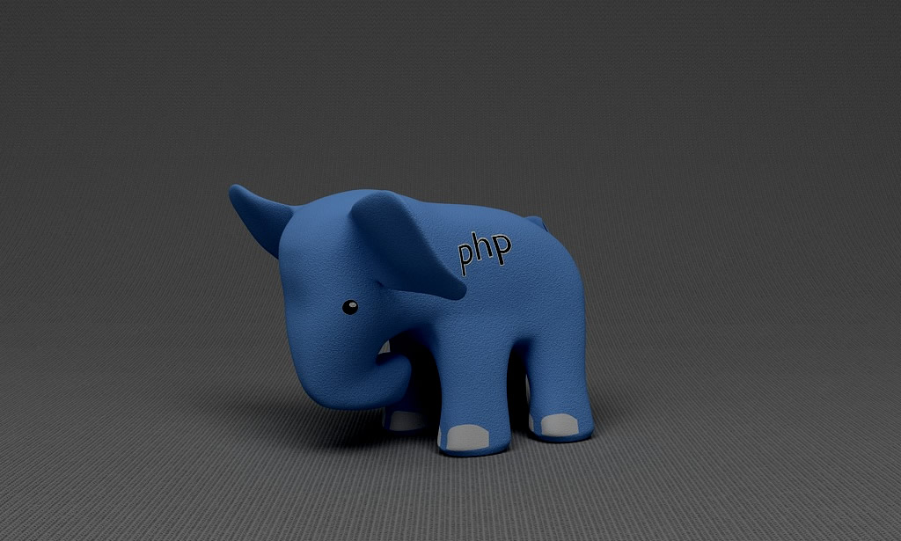

# PHP Library

**Useful PHP building blocks, ready to compose.**

PHP Library is a collection of focused PHP 8.5 helpers for dates, validation,
files, spreadsheets, HTTP services, site metadata, SQL connections and more.

```{toctree}
:maxdepth: 2
:caption: Contents

getting-started
arrangements-and-data
files
numericals
web-and-sites
database
api-reference
migration
```



## Install

```bash
composer require zlatanstajic/php-library
```

Composer provides the autoloader. Import the class you need and call it
directly:

```php
<?php

require __DIR__.'/vendor/autoload.php';

use PHP_Library\Core\Arrangements\Date_Time_Format;
use PHP_Library\Core\Data\Validation;

$published = Date_Time_Format::format_to_database('29.08.2026');
$slug = Validation::rewrite_special('PHP biblioteka');
```

## Explore the library

### Arrange and validate

Format dates, email addresses, prices, byte counts and strings. Generate secure
random values and format standards-compliant URLs. See
[Arrangements and data](arrangements-and-data.md).

### Work with files

Read and write files, list directories, import or export spreadsheets, and
distribute files into generated folders. See [Files and spreadsheets](files.md).

### Build web integrations

Call HTTP endpoints, produce page metadata and assets, connect through PDO, and
create MySQL dumps. See [Web and sites](web-and-sites.md).

## Design conventions

- Static utility classes are stateless and can be called directly.
- Stateful integrations record errors instead of throwing them.
- Numeric strings are accepted where the API declares `int|float|string`.
- Return shapes include ready-to-display values alongside raw values.

```{note}
The library is tested with Pest and requires at least 80% line coverage on
every project check.
```

[Download the latest release](https://github.com/zlatanstajic/php-library/releases/latest)
